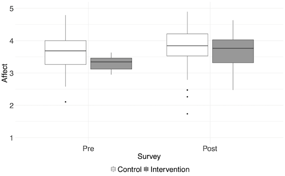
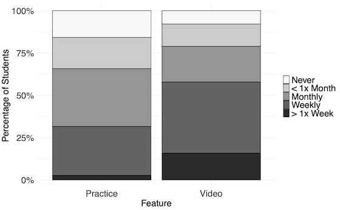

```{r setup, include=FALSE}
knitr::opts_chunk$set(echo = FALSE)
```
        
# Codewit.us: A Platform for Diverse Perspectives in Coding

This is a brief summary of *Codewit.us: A Platform for Diverse Perspectives in Coding*, presented at the [53rd ACM Technical Symposium on Computer Science Education (SIGCSE'22)](https://sigcse2022.sigcse.org/) and published in the proceedings.

This presentation page is available at [learnbyfailure.com/sigcse2022-platform](https://learnbyfailure.com/sigcse2022-platform/) and its source is available on [GitHub](https://github.com/kbuffardi/sigcse2022-platform/).

# Preface

* There are ongoing efforts to broaden participation in computing
* Recommendations highlight a need for teaching computing in ways that are [relevant and meaningful to broader audiences](https://doi.org/10.1145/3502870.3506568)
* Observed students' inclination to seek lessons via YouTube, with mixed results
  * There are some good amateur tutorials on many programming essentials
  * Videos tended to use the same contexts as often seen in traditional CS classes (e.g. tip calculators, puzzles/games, bowling scores, etc.)
  * Some propogated bad practices (e.g. every loop being `while(true)`)
  * Students often passively watched videos, did not immediately apply the practices
* Our [previous research on students' interests](../interests/) indicated significant discrepancies in some areas of students' interests, especially by gender:
  * **Games** - Majority 68% vs Minority 36% ($\chi$^2^=5.50, df=1, p<.05)
  * **Robots/microcontrollers/electronics** Majority 36% vs Minority 14% ($\chi$^2^=4.87,df=1, p<.05)

**We want to provide students with new perspectives and applications of coding fundamentals, while also facilitating hands-on learning of those skills.**

# Developing Learning Materials

We want to facilitate learning through both [affective and cognitive learning outcomes](https://en.wikipedia.org/wiki/Bloom%27s_taxonomy) by engaging students in active learning.

We also want materials to be **student-driven** to share their unique perspectives.

* [Chico State](https://csuchico.edu) and [UC Santa Barbara](https://ucsb.edu) are **Hispanic-Serving Institutions**
* Unique opportunity to share perspectives of historically marginalized students

## Inclusive Video Demonstrations

We hired students to share brief demonstrations of how they would relate CS1 topics to *their lives and interests*.

However, the *Covid-19 pandemic* forced us to record from home. We provided students with:

* 1080p HD webcams, 
* USB microphones, 
* Ring lights
* Cost approaching $200 per student
* Students recorded using [OBS](https://obsproject.com/) to capture their [Replit IDE](https://repl.it) with a picture-in-picture video of their faces.

### Examples

**Destiny demonstrates vectors to maintain a music playlist**

<!--html_preserve-->
<iframe width="560" height="315" src="https://www.youtube.com/embed/jxih9YOA5aM" title="YouTube video player" frameborder="0" allow="accelerometer; autoplay; clipboard-write; encrypted-media; gyroscope; picture-in-picture" allowfullscreen></iframe>
<!--/html_preserve-->


**Jessica uses primitive data types to represent soccer player data**

<!--html_preserve-->
<iframe width="560" height="315" src="https://www.youtube.com/embed/BVK6rCz_7SQ" title="YouTube video player" frameborder="0" allow="accelerometer; autoplay; clipboard-write; encrypted-media; gyroscope; picture-in-picture" allowfullscreen></iframe>
<!--/html_preserve-->


As restrictions lifted, we began recording using campus studios featuring transparent lightboards which allow the student to face the camera in higher quality video.

### Example 

**Andrea illustrates pointers on a lightboard**

<!--html_preserve-->
<iframe width="560" height="315" src="https://www.youtube.com/embed/YGj-HgRFOk0" title="YouTube video player" frameborder="0" allow="accelerometer; autoplay; clipboard-write; encrypted-media; gyroscope; picture-in-picture" allowfullscreen></iframe>
<!--/html_preserve-->

Videos are made available via [our YouTube Channel](https://www.youtube.com/channel/UCP8J1udzFAdZqdaSUPlAsZg/videos)


## Interactive Drill-and-Practice

We developed small C++ coding problems that emphasized concepts that corresponded with each video. We used [CodeWorkout](https://codeworkout.cs.vt.edu/) to host the problems in an interactive environment.

All our [C++ exercises are public on CodeWorkout](https://codeworkout.cs.vt.edu/gym/exercises/search?utf8=%E2%9C%93&search=c%2B%2B)

# Preliminary Investigation

* Two semesters of CS1 course (n=216) at Chico State (*CSCI 111 Programming and Algorithms I*)
* Both semesters were online, synchronous courses (Zoom) due to the pandemic
* **Control** (n=161) - assigned readings from eBooks
* **Intervention** (n=55) - assigned readings *plus* videos and workouts
  * A video was embedded in the learning management system (LMS) after the assigned reading on the corresponding concept.
  * Sets of problems on the same concept were organized as 'workouts' and direct links to the workouts were provided in the LMS after the video.
* Students answered Pre/Post semester surveys to guage **affective outcomes**
  * Adopted instruments to measure general affect (i.e. sense of belonging) and self-efficacy specific to C++ skills
  * Post survey also gathered students' self-reported usage of videos and practice
  
# Insights

Compared to the control, we found students with the materials available **showed significantly greater gains in affective outcomes**

 * Control ($\Delta$ M=0.18, sd=0.47) 
 * Intervention ($\Delta$ M=0.38, sd=0.47)
 * Wilcoxon test rejects null hypothesis (p<.05)



However, we found no significant difference in students' self-efficacy with specific C++ skills

* Control ($\Delta$ M=2.08, sd=1.29) 
* Intervention ($\Delta$ M=2.26, sd=1.18) 
* Wilcoxon test found no significant differences (p=.247)
 
We also investigated students' voluntary usage of the videos and practice problems:




# Platform Development

We decided to develop a software platform to give our students a figurative platform to share their perspectives.

[Codewit.us](https://codewit.us) integrates the [brief video tutorials with corresponding programming problems](https://codewit.us/tutorial/variables_soccer/).

* CodeWorkout maintained as the engine for practice
* Codewit.us is *Free and Open Source Software* [on GitHub](https://github.com/kbuffardi/codewitus/) but also [hosted for your use, free of charge](https://codewit.us/)
  
We have piloted Codewit.us as a supplementary source for students. *Stay tuned for new findings...*

# Acknowledgements

The authors of this paper are grateful for the instructors who incorporated the surveys into their courses, which was essential for this work. This material is based upon work supported by the Learning Lab, an initiative of California Governor’s Office of Planning and Research. Any opinions, findings, and conclusions or recommendations expressed in this material are those of the author(s) and do not necessarily reflect the views of the Learning Lab.

Particular thanks to our students who have shared their valuable insights in producing videos to date:

* Johanna Alvarado
* Juan Aguirre-Ayala
* Andrea Anez
* Phinease Francis
* Jason Gonzalez
* Jessica Martinez
* Destiny Rogers

# Full Paper

The full paper is available via ACM Digital library *(link coming soon)*

To cite this paper, use the following reference in your bibliography:

>
> ACM bibliographic entry coming soon
>

Or import the following *BibTeX* reference:

```
% BibTeX reference coming soon
```

